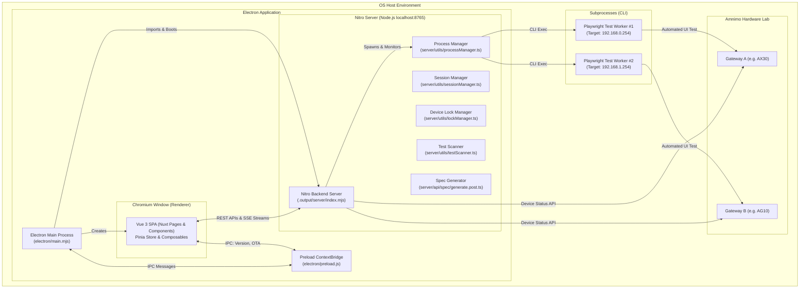
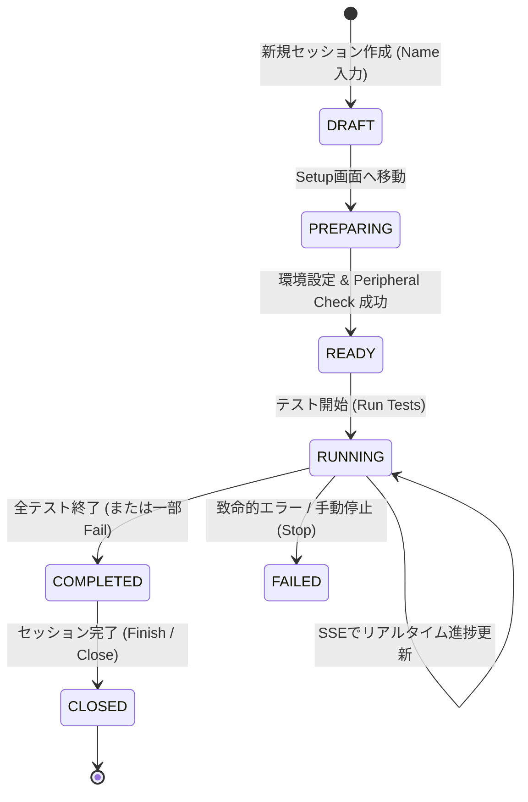
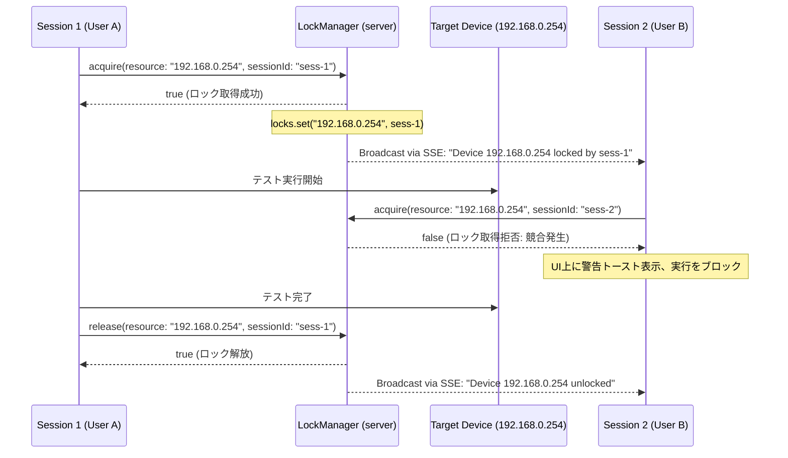

# Amnimo Test Runner アーキテクチャ詳細 (Architecture Deep Dive)

本ドキュメントでは、**Amnimo Test Runner** の内部構造、プロセスモデル、各コア機能の設計思想、およびデータフローの詳細を技術的に解説します。

---

## 1. 全体アーキテクチャとプロセスモデル

アプリケーションは **Electron** をホスト環境とし、内部で **Nuxt 4 / Nitro サーバー** を立ち上げ、子プロセスとして **Playwright CLI** を制御するハイブリッド・アーキテクチャを採用しています。



### プロセス分離の利点:
- **UIフリーズの完全防止**: テストの実行（Playwright）や大量ログのパースは別プロセスで非同期処理されるため、画面が重くなったり固まったりしません。
- **マルチセッション並列性**: 各セッションが独立したポート（`CLI_SERVER_PORT`）と環境変数（`.env`）を持ち、同時に複数の実機に対して並列テストを実行可能です。

---

## 2. セッションライフサイクル (Session Lifecycle)

テストの管理単位である「セッション」は、以下の状態遷移を経て実行・完了・保存されます。



### 状態定義 (`shared/constants/index.ts`):
- **`Draft`**: セッション名が登録された初期状態。ターゲットボードや `.env` の設定が未完了。
- **`Preparing`**: ターゲットボードの選択、`.env` 編集、周辺機器チェックを実行中。
- **`Ready`**: すべての前提チェック（Ping, SIM, Storage, PoE, DHCP）がパスし、テスト実行画面（`/runner`）への遷移が許可された状態。
- **`Running`**: Playwright プロセスが子プロセスとして起動中。ログストリームを受信。
- **`Completed`**: 指定されたテストスイートの実行が完了し、結果レポートが集計された状態。
- **`Closed`**: ユーザーによってセッションがクローズ（ロック解放済み、読み取り専用）された状態。

---

## 3. テストスキャンと実行エンジン

### 3.1 テストケースのスキャン (`testScanner.ts`)
1. **ディレクトリ構造の解析**:
   - `amnimo-e2e/playwright/tests/{type}/`（`release` または `system-test`）を再帰的に走査。
2. **階層順ソート**:
   - `simple-settings` $\rightarrow$ `side-menu` $\rightarrow$ `dashboard` $\rightarrow$ `header` $\rightarrow$ `network` $\rightarrow$ `system-test` $\rightarrow$ `service` $\rightarrow$ `management` の順序で自然に並ぶようカスタムソートを適用。
3. **Playwright リスト出力の解析**:
   - `npx playwright test --list --reporter=json` を実行し、各ファイル内の `test("...", ...)` タイトルを抽出。
4. **キャッシュ機構**:
   - 走査結果は `server/data/base-test-cases-{type}.json` に保存され、2回目以降のアクセスを瞬時に高速化。UI 上の「Refresh」ボタンで明示的に再スキャン可能。

### 3.2 テスト実行とプロセス管理 (`processManager.ts`, `tests/run.post.ts`)
- **コマンド生成**:
  ```powershell
  # 実行例
  npx playwright test "playwright/tests/release/dashboard" --reporter=line,html --output=test-results
  ```
- **環境変数の動的注入**:
  - セッション固有の `.env` ファイルの内容（IPアドレス、認証情報、ポート番号）を環境変数オブジェクトに展開して子プロセスに渡します。
- **標準出力（stdout/stderr）の監視**:
  - `liveProgressParser.ts` がリアルタイムにログを行単位で解析し、`running`、`passed`、`failed`、`skipped` のカウントをインクリメントしてストリームへ送出します。

---

## 4. リアルタイムストリーミング (Server-Sent Events)

ポーリングによる無駄な負荷を排除するため、サーバーからフロントエンドへの進捗通知には **Server-Sent Events (SSE)** を採用しています。

```text
[Frontend (Vue)]                              [Backend (Nitro)]
       |                                             |
       |  GET /api/tests/stream?sessionId=xxx       |
       | ------------------------------------------> |
       |  HTTP 200 (text/event-stream)               |
       | <------------------------------------------ |
       |                                             |
       |  event: progress (testCounts: pass, fail..) |
       | <------------------------------------------ |
       |  event: log (raw Playwright stdout line)    |
       | <------------------------------------------ |
       |  event: status_change (status: Completed)   |
       | <------------------------------------------ |
```

- **エンドポイント**:
  - `/api/tests/stream?sessionId={id}`: 実行中セッションのログ、進捗数値、個別ケースのステータス推移を配信。
  - `/api/locks/stream`: デバイスのロック取得・解放イベントを全クライアントへブロードキャスト。

---

## 5. デバイス排他ロック管理機構 (`lockManager.ts`)

IoT ゲートウェイの実機テストでは、**「同一デバイスに対して2つのセッションが同時に設定変更やテストを実行する」** と設定が破壊され、正確な検証が不可能になります。
これを防ぐため、メモリ上にシングルトンの **`lockManager`** を構築しています。



### 再入可能性 (Re-entrancy):
- 同一の `sessionId` からの重複取得リクエストは `true` と判定され、自セッション内のステップ進行を妨げません。
- セッションが完了・停止・クローズした際、`releaseAllForSession(sessionId)` が自動呼出しされ、ロックの解放漏れを防ぎます。

---

## 6. ハードウェア周辺環境チェック (Peripheral Checklist)

テスト実行前にデバイス実機と通信し、物理的な配線や外部モジュールが準備されているかを自動検証するコンポーネント群です。

| チェック項目 | 実装コンポーネント | 検証内容・API |
| :--- | :--- | :--- |
| **接続疎通 (Ping)** | `useNetworkCheck.ts` | `/api/network/ping` を経由してターゲット IP に ICMP/TCP 疎通確認 |
| **SIMカード認識** | `PeripheralSimCheck.vue` | ゲートウェイの `/api/proxy/device/mobile` を呼び出し、Slot 0 の SIM 認識状態・キャリアを確認 |
| **外部ストレージ** | `PeripheralStorageCheck.vue` | `/api/proxy/device/storage/partitions` を呼び出し、機種に応じた `sda`, `sdb`, `nvme0n1`, `mmcblk1` (SDカード) のマウント状況を検証 |
| **PoEカメラ** | `PeripheralPoeCheck.vue` | `/api/proxy/device/poe` を呼び出し、給電ポート（LAN1〜LAN4）にカメラが正しく接続されているか確認 |
| **Nx Witness** | `PeripheralNxWitnessCheck.vue` | Nx Witness サーバーへの疎通およびポート 7001 の開放状況を確認 |
| **DHCP Partner GW** | `PeripheralDhcpCheck.vue` | DHCPクライアント役の対向ゲートウェイへ `/api/proxy/device/dhcp-partner` で疎通・DHCP4有効化を確認 |

---

## 7. レポート集計と Excel 試験仕様書自動生成

テスト完了後、品質管理部門へ提出する公式の試験仕様書（Excel）を自動生成するパイプラインです。

```text
[Playwright Reports]                [reportUtils.ts]
e2e-reports/.../index.html   ===>   集計処理 (Flatten Test Map)
test-results/results.json            - Test-ID: "GUI_NETWORK_001"
                                     - Result: "Passed" -> "Pass"
                                     - Firmware: "v3.8.0"
                                     - Model: "AX30", Serial: "..."
                                            |
                                            v
                                [spec/generate.post.ts]
                                            |
             +------------------------------+-------------------------------+
             |                                                              |
             v                                                              v
[spec-manager/template/                   [xlsx-populate]
 リリーステスト_試験仕様書.xlsx]          - Sheet "【GUI】...": 合否・日時・機番をセル転記
                                          - Sheet "progress": ターゲット機種名を書き込み
                                            各シートの Pass/Fail 統計を自動再計算
                                            |
                                            v
                                  [generated-specs/
                                   AX30_リリーステスト_試験仕様書.xlsx]
```

- **使用ライブラリ**: `xlsx-populate`（数式・マクロ・装飾書式を壊さずにセルデータのみを安全に置換）。
- **進捗シートの自動数式計算**: Excel を開く前でもプレビュー表示できるよう、`spec/preview.get.ts` 内で `progress` シートの集計ロジック（MUST/OPTION別の消化率・合格率）をエミュレート計算しています。

---

## 8. データ永続化モデル (Data Persistence)

アプリのデータは実行環境に応じて適切な場所に保存されます。

- **本番環境 (Electron ビルド版)**:
  - `process.env.APP_DATA_PATH` $\rightarrow$ OS 規定の UserData パス（Windows: `%APPDATA%\Amnimo Test Runner`）
  - 保存内容: `settings.json`, `sessions/{sessionId}/session.json`, `generated-specs/`
  - **メリット**: アプリをアンインストール・バージョンアップしても、過去のテスト履歴やレポートが安全に維持されます。
- **開発環境 (Web / Dev モード)**:
  - プロジェクト直下の `sessions/` および `generated-specs/` に保存されます。
