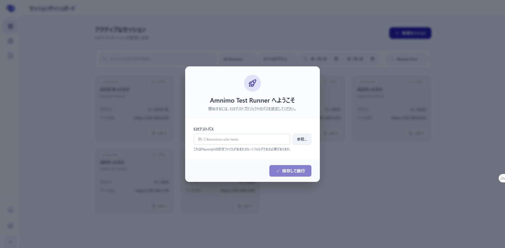
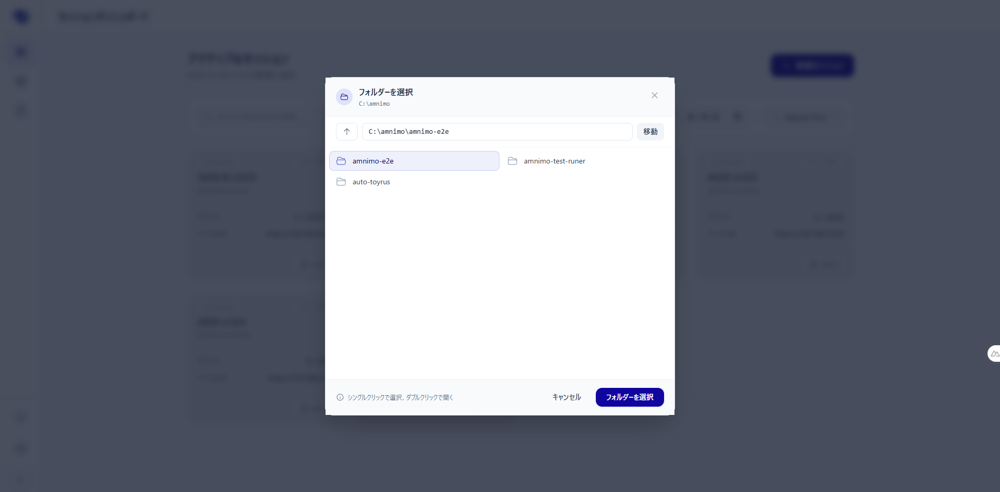
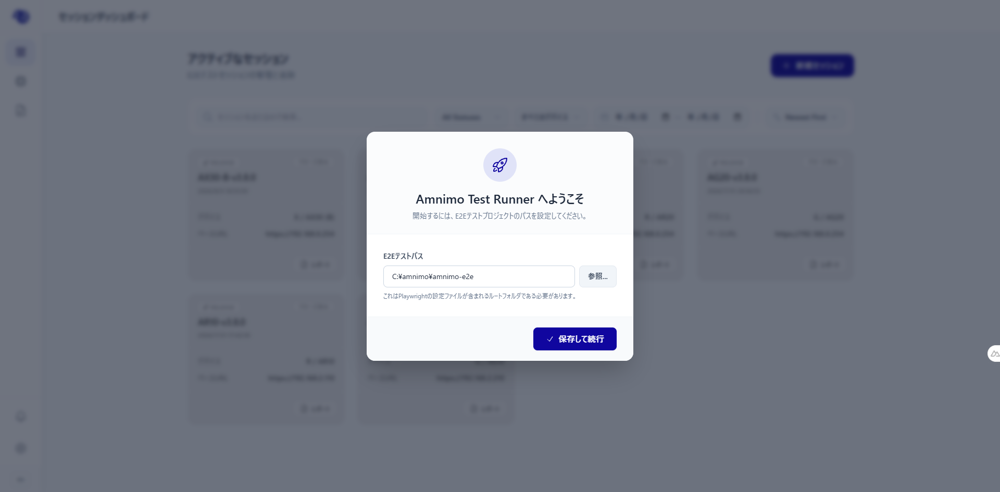

# 手順書 - Amnimo Test Runner

本書は、**Amnimo Test Runner** ソフトウェアの操作方法をステップバイステップで詳しく説明する手順書です。

---

## 1. 初回起動と初期設定 (Initial Setup)

Amnimo Test Runnerを初めて起動する際、テストのソースコードフォルダ（`amnimo-e2e`）へのパスを設定する必要があります。これは、ソフトウェアがテストデータを取得する場所を認識するために必須のステップです。

### 手順：

1. **アプリの起動:** デスクトップまたはスタートメニューからAmnimo Test Runnerを起動します。
2. **パス設定の要求:** メイン画面に、ルートパス（e2e path）の設定を求めるメッセージが表示されます。
3. **フォルダ選択ダイアログを開く:** 画面上の **「参照...」**　ボタンをクリックします。

4. **`amnimo-e2e` フォルダの指定:**
   - システムのウィンドウが表示されます。`amnimo-e2e` プロジェクトを保存したドライブおよびフォルダまでナビゲートします。
   - _例: `C:\amnimo\amnimo-e2e`_
   - **「フォルダーの選択」** をクリックして確定します。

5. **「保存して続行」** をクリックして確定します。
6. アプリケーションはこのパスを自動的に検証し、保存します。次回以降の起動時にはこのステップは不要となり、直接セッション管理画面が表示されます。
